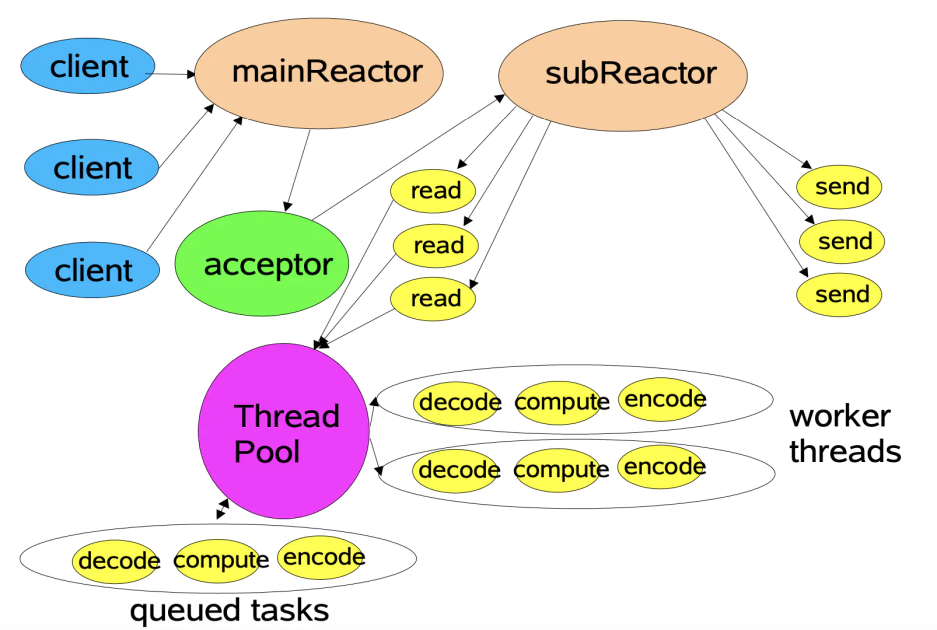

# muduo
## 整体结构

## 在muduo中，调用关系如下
* 将事件及其处理方法注册到reactor,reactor存储了连接套接字connfd以及其感兴趣的事件event
* reactor向其所对应的demultiplex去注册相应的connfd+事件，启动反应堆
* 当demultiplex检测到connfd上有事件发生，就会返回相应的事件
* reactor根据事件去调用eventhandler处理程序

## one loop per thread

## 模块介绍
* 事件轮询与分发:EventLoop Channel Poller EPoller 负责事件轮询检测并分发 
* 线程与实践: Thread EventLoopThread EventLoopThreadPool 绑定线程与事件循环，完成one loop per thread
* 网络连接: TcpServer TcpConnection Acceptor Socket 实现mainloop对网络连接的响应，并分发给subloop
* 缓存区: Buffer 可以自动扩容

## Reactor与Proactor
* Reactor模型是感知就绪可读写事件，才去主动将socket缓存区的数据读到应用程序中
* Proactor模型是感知已完成的事件，当发生读写请求的时候，只需要传数据缓冲区的地址，系统内核会把数据的读写工作完成，通知应用程序来拿

## LT与ET
* LT当文件描述符就绪时，会持续通知应用程序，直到事件被处理
* ET仅在文件描述符状态从未就绪变为就绪通知一次，之后不会在通知，除非状态再发生变化